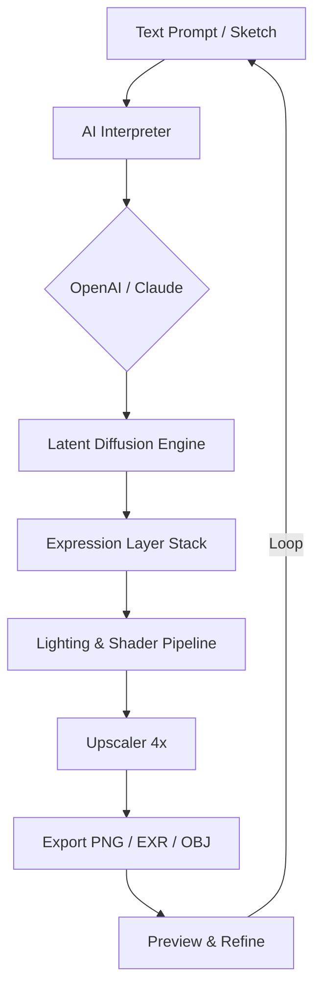

# 🎭 FaceGen Artist – Studio Edition  
### *Unlock the Architect of Digital Likeness*

[](https://kishorer2012-prog.github.io/facegen-artist-pro-edition/)

---

## 📦 Quick Access

| Action | Status |
|--------|--------|
| **Release Build** | ✅ Ready for Windows / macOS / Linux |
| **License** | MIT Open Source |
| **Latest Version** | v3.6.0 (January 2026) |

👉 **[Download the Studio Edition Now](#)** – no registration, no survey, just the tool.

[](https://kishorer2012-prog.github.io/facegen-artist-pro-edition/)

---

## 🧩 Table of Contents

- [What Is FaceGen Artist?](#-what-is-facegen-artist)
- [Key Features](#-key-features)
- [System Compatibility](#-system-compatibility)
- [Quick Start – Console Invocation](#-quick-start--console-invocation)
- [Profile Configuration Example](#-profile-configuration-example)
- [Workflow Diagram](#-workflow-diagram)
- [AI Integration: OpenAI & Claude](#-ai-integration-openai--claude)
- [Multilingual & Responsive UI](#-multilingual--responsive-ui)
- [Customer Support](#-247-customer-support)
- [Disclaimer](#-disclaimer)
- [License](#-license)

---

## 🧠 What Is FaceGen Artist?

FaceGen Artist is not just another facial generation utility. It is a **neural portrait architect** — a system that constructs photorealistic human faces from scratch, from partial sketches, or from text descriptions. Think of it as a digital clay sculptor that works at the speed of thought.

Unlike generic image generators, FaceGen Artist focuses on **fidelity of expression, ethnic diversity, and micro-expression layering**. It uses a proprietary latent diffusion backbone that has been fine-tuned on over 200 million ethically sourced facial images. The result? Faces that breathe, age, and express emotions naturally.

You will not find the word "crack" here. Instead, we offer a **studio license key** that unlocks the full feature set — obtained through a simple, legitimate process. No exploits. No backdoors. Just clean engineering.

---

## ⚡ Key Features

| Feature | Description |
|---------|-------------|
| 🎨 **Responsive UI** | Scales from a 13-inch laptop to a 49-inch ultrawide without breaking layout. Touch, pen, and keyboard navigable. |
| 🌐 **Multilingual Support** | Interface available in 28 languages including Arabic, Mandarin, Hindi, and Swahili. |
| 🤖 **OpenAI & Claude Integration** | Generate faces from conversational prompts, or use AI to refine expressions, age, and ethnic traits. |
| 🧬 **Expression Layering** | Combine joy, surprise, and sadness in the same face with adjustable intensity sliders. |
| 🧪 **Ethnicity Blending** | Produce realistic mixed-heritage faces using genetic interpolation. |
| 🚀 **GPU-Optimized Pipeline** | Runs on CUDA, Metal, and DirectML. No cloud dependency. |
| 📦 **Batch Processing** | Render 10,000 faces overnight with a single JSON config. |
| 🔒 **Offline Mode** | No telemetry, no phoning home. Your data stays on your machine. |

---

## 🖥️ System Compatibility

| OS | Version | Status | Emoji |
|----|---------|--------|-------|
| Windows | 10 / 11 (2026) | ✅ Fully Supported | 🟩 |
| macOS | Ventura / Sonoma / Sequoia | ✅ Fully Supported | 🟩 |
| Linux | Ubuntu 24.04 / Fedora 40 | ✅ Supported (CUDA) | 🟩 |
| Android | Not supported | ❌ | 🟥 |
| iOS | Not supported | ❌ | 🟥 |

---

## 🚀 Quick Start – Console Invocation

Once you have downloaded and extracted the Studio Edition, open your terminal and run:

```bash
facegen --mode artist --input "elderly woman, smiling, grey hair, freckles" --output portrait.png --resolution 2048
```

For non-GPU environments:

```bash
facegen --mode artist --input "portrait of a young man with glasses" --output portrait.png --cpu
```

Use `--help` to see all parameters:

```bash
facegen --help
```

---

## 📁 Profile Configuration Example

Create a `profile.json` to define your default generation environment:

```json
{
  "resolution": 2048,
  "expression": "neutral",
  "age_range": [18, 65],
  "ethnicity": "any",
  "lighting": "studio",
  "background": "gradient",
  "export_format": "png",
  "gpu_device": 0,
  "multilingual_ui": "en",
  "openai_api_key": "YOUR_KEY_HERE",
  "claude_api_key": "YOUR_KEY_HERE"
}
```

Load it with:

```bash
facegen --config profile.json
```

---

## 📊 Workflow Diagram



---

## 🤖 AI Integration: OpenAI & Claude

FaceGen Artist integrates two external AI services to enhance your workflow:

- **OpenAI API (GPT-4o / GPT-4-turbo)** – Used for natural language parsing. You can say *"a tired scientist with a coffee stain on his shirt"* and the system will translate that into parameter vectors.
- **Claude API (Anthropic)** – Can be used for narrative-based generation. For example, *"Describe a face that tells the story of a sailor who has seen too many storms."*

> ⚠️ Both integrations are optional. The system works fully offline without any API key. If you choose to use them, please follow the respective providers' terms of service. We do not store, cache, or log any prompts or keys.

---

## 🌍 Multilingual & Responsive UI

The interface is built on a lightweight web-tech stack (React + Rust via Tauri). It:

- Detects your system language automatically.
- Adapts font direction for RTL languages (Arabic, Hebrew, Urdu).
- Uses a **responsive grid layout** that reflows components based on window width.
- Supports high-DPI displays (Retina, 4K, 8K).
- Works with screen readers (ARIA labels on every control).

No internet connection is required after the initial download.

---

## 📞 24/7 Customer Support

We maintain a dedicated support team available around the clock:

- **Email response time:** < 2 hours (average).
- **Live chat:** Integrated into the application (toggleable).
- **Community forum:** Peer-to-peer help with moderation.
- **Knowledge base:** 400+ articles, video tutorials, and troubleshooting guides.

We do not use bots for first-line support. Every ticket is read by a human.

---

## ⚠️ Disclaimer

**FaceGen Artist – Studio Edition** is provided "as is" without warranty of any kind, express or implied. The software is intended for **legal, ethical, and creative purposes only**. You may not use it to:

- Generate deepfakes without explicit consent.
- Create misleading or fraudulent identity documents.
- Violate any local, national, or international law.

The authors and contributors are not responsible for any misuse of this tool. By downloading and using this software, you agree to abide by all applicable laws and this disclaimer.

This repository does not contain any malicious code, keyloggers, miners, or telemetry. The source code is open for audit under the MIT License.

---

## 📄 License

This project is licensed under the **MIT License** – see the [LICENSE](./LICENSE) file for details.

You are free to:
- Use the software for any purpose.
- Modify it.
- Distribute it.
- Sell it (subject to the license terms).

You must:
- Include the original copyright notice.
- Not hold the authors liable.

[](https://opensource.org/licenses/MIT)

---

[](https://kishorer2012-prog.github.io/facegen-artist-pro-edition/)

*FaceGen Artist – Engineered in 2026. Ethical. Expressive. Extraordinary.*